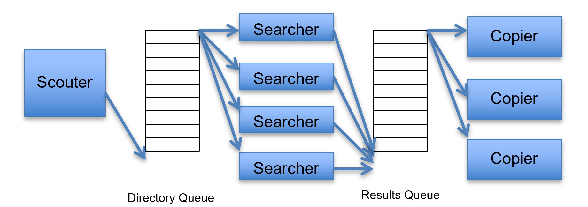

# DiskSearcher

This multithreaded search utility allow searching for files that contain some given pattern, under some given root directory. Files that contain this pattern will be copied to some specified directory.

Our application consists of two queues and three groups of threads:



## Files ##
* SynchronizedQueue.java - A synchronized bounded-size queue for multithreaded producer-consumer applications. 
* Scouter.java - This class is responsible to list all directories that exist under the given root directory. It enqueues all directorie into the directory queue. There is always only one scouter thread in the system.
* Searcher.java - This class reads a directory from the directory queue and lists all files in this directory. Then, it checks each file to see if the file name contains the given pattern. File name's that contain the given pattern are enqueued to the results queue (to be copied).
* Copier.java - This class reads a file from the results queue (the queue of files that contain the given pattern), and copies it into the specified destination directory.
* DiskSearcher.java - This is the main class of the application. This class contains a main method that starts the search process according to the given command lines.

## Getting Started ##
Usage of the main method from command line goes as follows:
```
> java DiskSearcher <pattern> <root directory> <destination directory> <# of searchers> <# of copiers>
```
For example:
```
> java DiskSearcher solution C:\OS_Exercises C:\temp 10 5
```
This will run the search application to look for files with the string “solution” contained in their names, in the directory C:\OS_Exercises and all of its subdirectories. Any matched file will be copied to C:\temp. The application will use 10 searcher threads and 5 copier threads.
