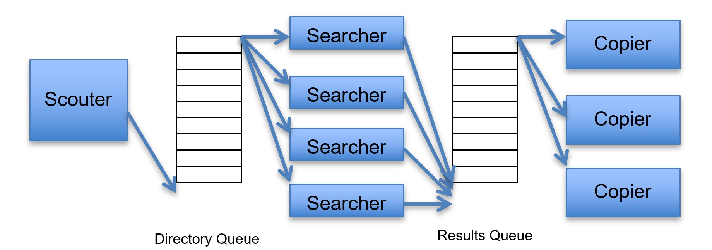

# DiskSearcher

This multithreaded search utility allow searching for files that contain some given pattern, under some given root directory. Files that contain this pattern will be copied to some specified directory.

Our application consists of two queues and three groups of threads:

